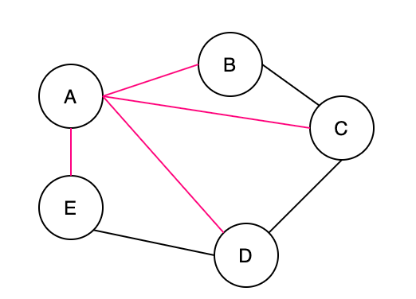
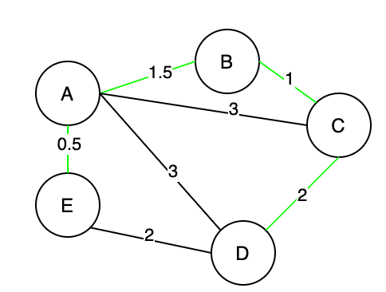
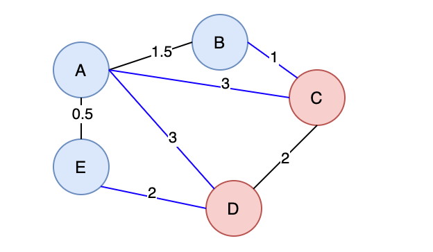

A spanning tree is a connected subgraph in an undirected graph where all vertices are connected with the minimum number of edges.In Figure, all pink edges [(A, B), (A, C), (A, D), (A, E)] form a tree, which is a spanning tree of this undirected graph. Note that [(A, E), (A, B), (B, C), (C, D)] is also a spanning tree of the undirected graph. Thus, an “undirected graph” can have multiple spanning trees.

After learning what a spanning tree is, you might have another question: what is a minimum spanning tree? A minimum spanning tree is a spanning tree with the minimum possible total edge weight in a “weighted undirected graph”. In Figure, a spanning tree formed by green edges [(A, E), (A, B), (B, C), (C, D)] is one of the minimum spanning trees in this weighted undirected graph. Actually, [(A, E), (E, D), (A, B), (B, C)] forms another minimum spanning tree of the weighted undirected graph. Thus, a “weighted undirected graph” can have multiple minimum spanning trees.

###  Cut Property

 - First, in Graph theory, a “cut” is a partition of vertices in a “graph” into two disjoint subsets. Figure 11 illustrates a “cut”, where (B, A, E) forms one subset, and (C, D) forms the other subset.
 - Second, a crossing edge is an edge that connects a vertex in one set with a vertex in the other set. In Figure 11, (B, C), (A, C), (A, D), (E, D) are all “crossing edges”.

So Cut property is as follows : <b>For any cut C of the graph, if the weight of an edge E in the cut-set of C is strictly smaller than the weights of all other edges of the cut-set of C, then this edge belongs to all MSTs of the graph.</b>   
 Basically, In the set of edges involved in cut ( edges in blue), the edge with the least weight, which is also less than the other edges in the cut belongs to the MST, joining the disjoint subsets

### Kruskal Algorithm

<b>“Kruskal’s algorithm” is an algorithm to construct a “minimum spanning tree” of a “weighted undirected graph”.</b>  

 - Sort all edges in ascending order
 - Add edges in that order into the MST, skipping those edges which form a cycle (Keep a track of connected edges and edge count)
 - Repeat the above step until we get N-1 edges (N-1 edges for N nodes)
 - If at the end, N-1 edges are not formed due to skipping, MST is not possible

Time complexity : O (E log E) , E  is number of edges and we are sorting them based on weight.

### Prims Algorithm

After learning about Kruskal's Algorithm, let's look at another algorithm, "Prim's algorithm", that can be used to construct a “minimum spanning tree” of a “weighted undirected graph”.  

 - Works with two sets, one with list of all non visited vertices and other with all visited ones
 - Start with picking a vertex from non visited set, add it to visited. Then check all the edges from that vertex and pick the one with least weight, add it to MST and add the other vertex involved in the edge to the visited list, remove from non-visited 
 - Then get all the edges of the updated set of all the visited vertices, and pick the minimum one and repeat the above step.
 - Stop when visited set size = N / non visited set is empty

Time complexity : O(E⋅logV) for Binary heap, and O(E+V⋅logV) for Fibonacci heap. , V is number of vertices and E is number of edges

<b>“Kruskal’s algorithm” expands the “minimum spanning tree” by adding edges. Whereas “Prim’s algorithm” expands the “minimum spanning tree” by adding vertices.</b>  

