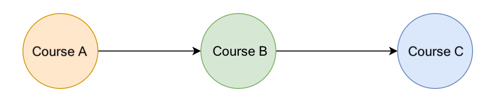

### Overview of Kahn's Algorithm for topological sorting

When selecting courses for the next semester in college, you might have noticed that some advanced courses have prerequisites that require you to take some introductory courses first. In Figure below, for example, to take Course C, you need to complete Course B first, and to take Course B, you need to complete Course A first. There are many courses that you must complete for an academic degree. You do not want to find out in the last semester that you have not completed some prerequisite courses for an advanced course. So, how can we arrange the order of the courses adequately while considering these prerequisite relationships between them?

“Topological sorting” helps solve the problem. It provides a linear sorting based on the required ordering between vertices in directed acyclic graphs. To be specific, given vertices u and v, to reach vertex v, we must have reached vertex u first. In “topological sorting”, u has to appear before v in the ordering. The most popular algorithm for “topological sorting” is Kahn’s algorithm.

#### Explanation : 

Let's say we have 4 courses A,B,C,D with prerequisite relations as follows

A - no prerequisite
B - A,C
C - A
D - B,C

 - Start by calculating all vertices' in degree, in the process when we find a vertex with indegree 0, add it to the queue, which is A here
 - Mark A as complete/visited, and remove from the queue and add it to the completed array
 - Then search other courses which have A as prerequisite, and reduce their indegree by 1
 - Pick any/one course/vertex with indegree as 0, add it to Queue and repeat the process
 - Stop when queue is empty
 - The order of the courses in the completed/visited array is the topological sorting order

Note, for simplicity while introducing Kahn's algorithm, we iterated over all of the courses and reduced the in-degree of those for which the current course is a prerequisite. This requires us to iterate over all EE prerequisites for all VV courses resulting in O(V⋅E) time complexity at the cost of O(V) space to store the in degree for each vertex.

However, this step can be performed more efficiently by creating an adjacency list where adjacencyList[course] contains a list of courses that depend on course. Then when each course is taken, we will only iterate over the courses that have the current course as a prerequisite. This will reduce the total time complexity to O(V + E)O(V+E) at the cost of an additional O(E)O(E) space to store the adjacency list.

#### Limitations

 - “Topological sorting” only works with graphs that are directed and acyclic.
 - There must be at least one vertex in the “graph” with an “in-degree” of 0. If all vertices in the “graph” have a non-zero “in-degree”, then all vertices need at least one vertex as a predecessor. In this case, no vertex can serve as the starting vertex.

Time complexity : O(V + E)

Space complexity : O(V + E)
