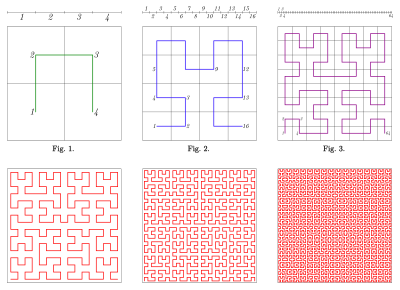

## Location Based Databases or searching applications

There are applications like uber/doordash/google maps where we search for entities within a distance range. There are two requirements for themselves
 - Storing the coordinates/location details in a uniform way so that we can measure the distance 
 - Proximity - Given a point, should be able to find out the closest points in the plane to the current point by some degree

The following strategies are useful for computing distance between entities efficiently and

### Storing Latitude and Longitude values upto 32 bits

Instead of computing euclidean distance between all points, we can do bit comparison. like we store 32 bits of latitude and longitude, and just compare the bits upto a degree based on the distance filter. Quad Trees come into picture, which divide coordinates in the world based on bit comparison classification

But, this is also not a very efficient model, since there are some anomaly values. Like lets say (0.5,0.5) and (-0.5,-0.5) are very close points but belong to different quadrants. For example

### Converting 2d plane to 1d plane for better and efficient range queries and maybe binary searching

There is this concept of fractals, in computer graphics where fractional dimensions exist. like 1.5D, not 1D or 2D. This is the process of representing a 1D representation of a 2D plane. For example

Lookup Hilbert curve, the most famous fractal, which looks like an inverted capital C, if you draw that on 2D plane, it touches all quadrants. Go recursively, by dissecting each quadrant into 4 sub-quadrants, and there is a sub hilbert curve existing. This way, you could keep zooming in and connecting deeper points using hilbert curve, and efficiently perform range queries. Refer image below for understanding : 

This is a much more popular and efficient model used ot calculate range/proximity queries, used by Uber, Google Maps
