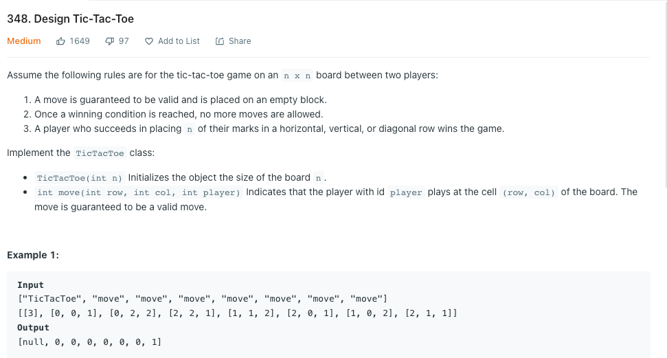

```
class TicTacToe {
    private int[] rows;
    private int[] cols;
    private int diagonal;
    private int antidiagonal;

    public TicTacToe(int n) {
        this.rows = new int[n];
        this.cols = new int[n];
        this.diagonal = 0;
        this.antidiagonal = 0;
        
    }
    
    public int move(int row, int col, int player) {
        
        int currentPlayer = player == 1 ? 1 : -1;
        
        rows[row] += currentPlayer;
        cols[col] += currentPlayer;
        
        if(row == col)
            diagonal += currentPlayer;
        
        if(col == (cols.length - row -1))
            antidiagonal += currentPlayer;
        
        int n = rows.length;
        
        if(Math.abs(rows[row])== n || (Math.abs(cols[col]) == n) || Math.abs(diagonal) == n || Math.abs(antidiagonal) == n )
            return player;
        
        return 0;
        
    }
}

/**
 * Your TicTacToe object will be instantiated and called as such:
 * TicTacToe obj = new TicTacToe(n);
 * int param_1 = obj.move(row,col,player);
 */

```
